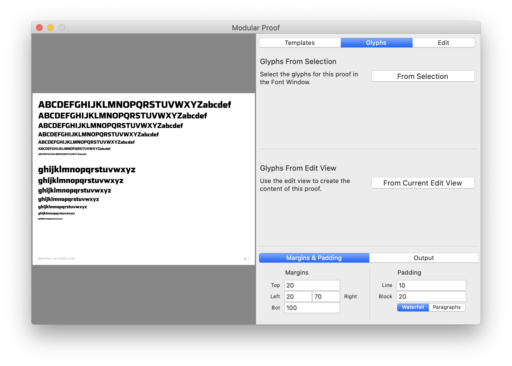
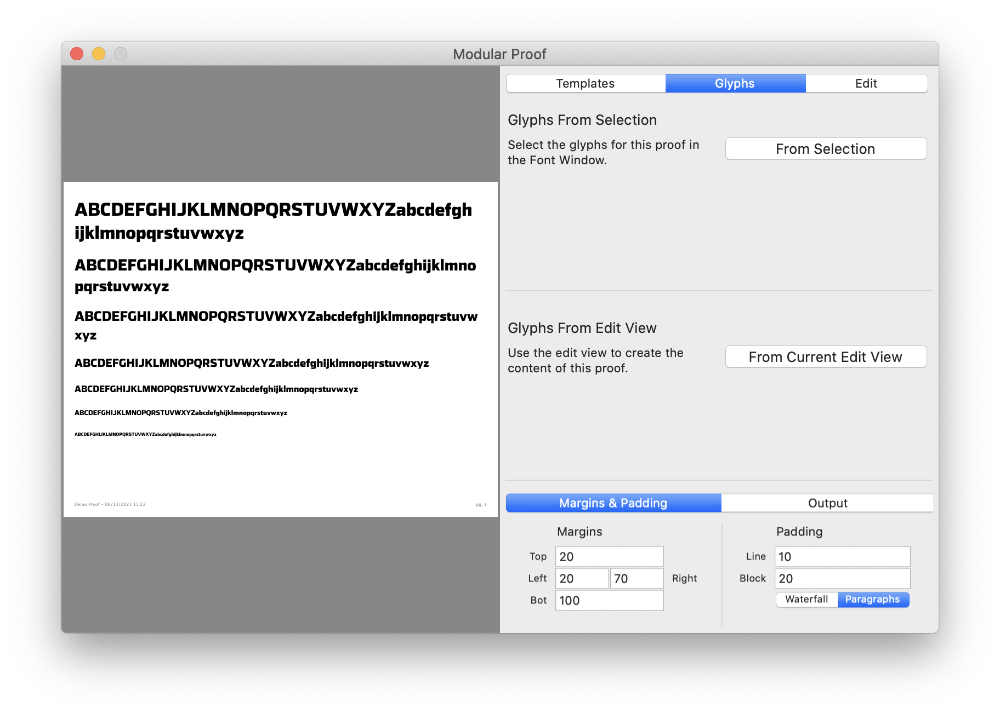
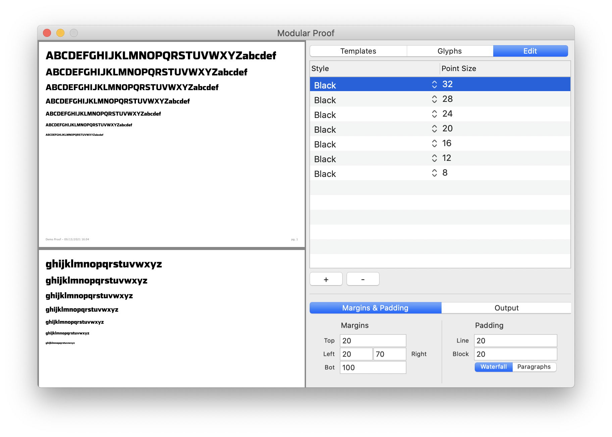
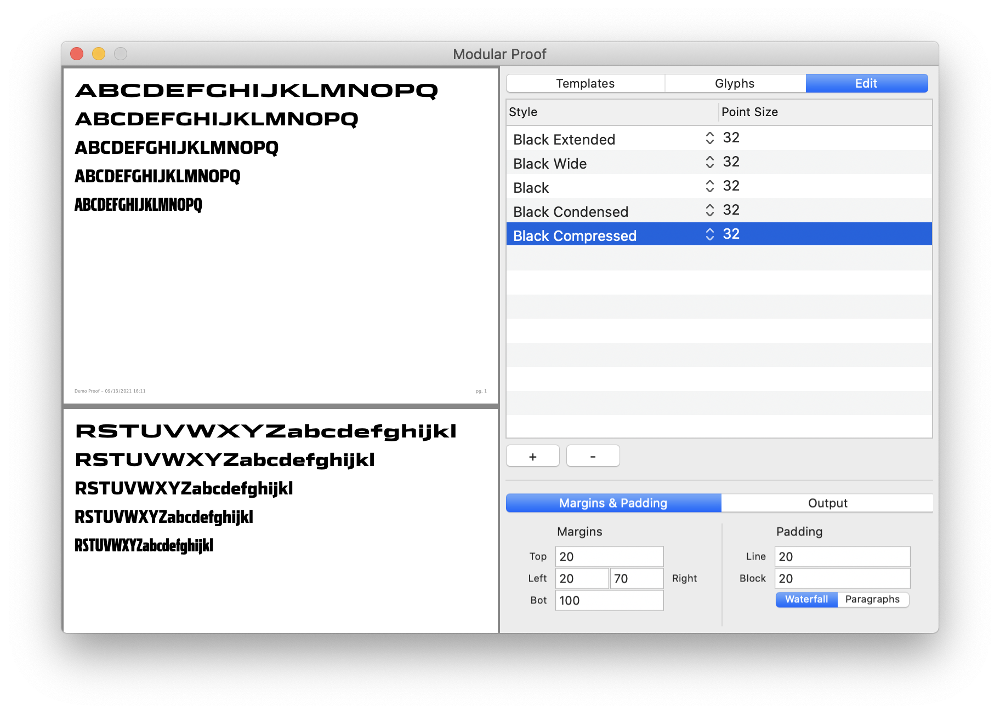
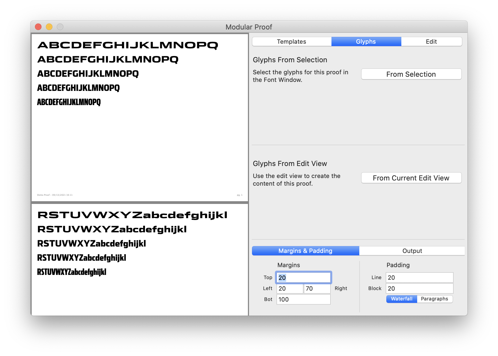
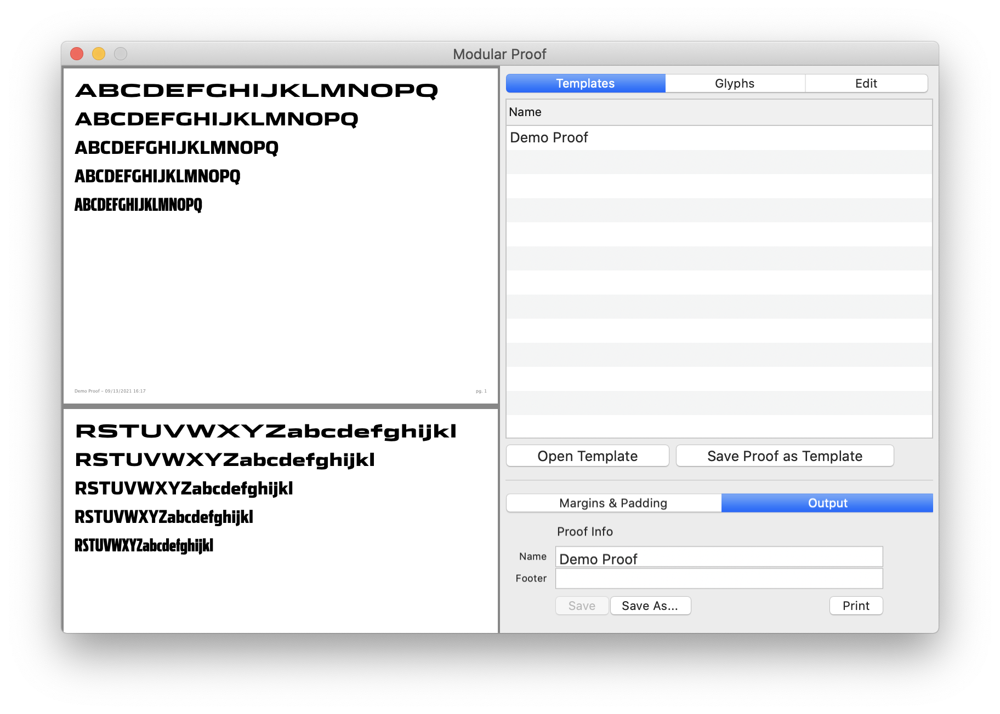

# Occupant Proofing Tool

This Glyphs Plugin helps you output proofs directly from Glyphs. The plugin focuses on generating form comparison proofs like waterfalls, rather than proofs that help you proof typesetting and opentype features. These capabilities may be added at some point in the future.

For a items on our roadmap and a changelog, look at [this document](https://docs.google.com/document/d/1z0BD3hXVslzn5acJ_5KomH_WkwnMeQ9gEiJh3z79fHE/edit).

**⚠️ NOTE: ⚠️** This application was recently converted to render instances. You must have `exports` setup in your Font Information for the tool to work.

**⚠️ NOTE: ⚠️** Using instance geometry requires instances to be re-interpolated when the script starts up. Because of this, if you have a lot of instances, starting the proofing tool can take some time as instances are reinterpolated. At some point I'll optimize this so that it only reinterpolates the instances you need.

## Using the Tool

This tool can be used to format and output paragraphs and waterfalls of text set in an in-progress typeface from directly inside of Glyphs 3. It should help you quickly format for proofing use without needing to export font binaries, deal with font caching, or open InDesign. We made this tool with the hope that it might reduce the annoyance of producing proofs for in-progress work.

The proofing tool is intendended for comparing runs of text in a typeface across styles and sizes. It can produce two different kinds of proofs: Waterfall proofs and paragraph proofs.

**Waterfall** proofs are for line-by-line comparison. A waterfall proof prints _a single line of text_ per selected style.



The proof in the above image sets the text `ABCDEFGHIJKLMNOPQRSTUVWXYZabcdefghijklmnopqrstuvwxyz` in a waterfall style. The text is broken up into blocks of a single line per style or size (this image shows ). Any text that doesn't fit into the line is pushed to the next block. If the block doesn't fit entirely on the page, the entire block is shifted onto the next page.

A **Paragraph** proof of the same text illustrates the difference.



In the paragraph proof, the entire text is displayed in a single paragraph, before we move on to the next style. (As you can tell from the above image, the Paragraph proof is best suited to longer paragraphs of text.)

### Making a New Proof

Along the top of the tool, you'll see three tabs: `Templates`, `Glyphs`, and `Edit`. We'll cover these from right to left, starting with `Edit`.

The `Edit` tab allows you to set up your proof by selecting the styles and point sizes you'd like to compare. Each line in the list on the edit view corresponds to a style and point-size in your proof.



Here, the edit view is being used to set up a comparison across 7 different point sizes of the Black style of Stainless 2. Clicking on the Style Dropdown allows you to choose from between any instances in the current typeface.



The `Glyphs` tab lets you set the content of the proof by choosing which glyphs appear in it. You can do this either by selecting glyphs in the Font view in Glyphs.app, or by typing out a string of characters in an Edit Tab in Glyphs.app. Just select the glyphs, or set up your Glyphs.app Edit View, and then push the appropriate button in the `Glyphs` tab.



### Tweaking the Styles

Below the `Templates`, `Glyphs`, and `Edit` views, You'll find two more tabs: `Layout` and `Output`. These tabs display UI that helps you edit the layout of the proof and the proof metadata, respectively.

`Layout` is fairly self-explanitory; it helps you adjust the spacing in and around the blocks of text in the proof. All of the measurements in this section are specified in pixels. (At some point, we may change these into inches!). (In a previous version of the application, this was called `Margins & Padding`, so you may see that in images or documentation.)

The `Output` section allows you to name the proof file, save it as a pdf, and open a system dialog box to print it out directly from the application. The name of the proof appears on the bottom of the document in gray text.




### Saving a Template

Finally, the `Templates` tab allows you to save or load premade proof templates. Currently, one demo proof is shipped with the Proofing Tool. It lives in the `data` folder in this repository, and is loaded on startup. You can add additional proof templates to this folder, and they'll load on startup, too.

Once you've used the `Edit` view and the `Glyphs` tab to get the proof looking how you want it, you can save the proof as a template for future use by clicking the `Save Proof as Template` system dialog box. This will open a window that allows you to save the template as a JSON file somewhere on your machine. We recommend saving it in the git repository along with the rest of your project files.

Later, you can use the `Open Template` button to load a previously-saved template JSON file.


## Customizing Templates

This tool uses a JSON-based template format to store proof configurations on a pre-project basis. You can version control these JSON files together with the rest of your typeface sources, if you wish. The intention here is to provide a way of quickly rendering proofs, without having to configure the tool each time you want to use it.

Personally, I think the easiest thing to do is to directly edit the `data/demo.json` file in this respository to suit the needs of your project. You can keep the edited file in this repository and use it while you work, or copy it into your font project directory, for posterity. The tool will automatically load the contents of the `data/` directory when it starts up, so you can add however many proof templates you want to this folder while working, and they'll load on startup. (You can also open any json file in the tool while it's running, but these files aren't remembered between runs of the tool. For that reason, it's more convenient to just drop files in the `demo` folder directly and skip the load step.)

The rest of this section will walk you through the template syntax. Hopefully, it's pretty straightforward.

At the root, the template JSON looks like this:

```js
{
  "name": "My Proof's Name",
  "proof": { ... } // configuration for the proof
  "lines": [ ... ] // different styles to render...
  "glyphs": [ ... ] // list of glyph names in the file as strings.
}
```

Because each font may want slightly different glyph sets to render, and because each font has different or slightly different master names, it's best to make custom templates for each project.

Let's look at each of the keys in the JSON structure. The `"name"` key, obviously, is the name of the proof. It gets rendered at the bottom of the document and can be whatever you want.

The `"proof"` key contains all of the layout details for rendering the proof. It looks like the following JSON structure:

```js
{
  ...
  "proof": {
    /**
     * These are the page margins, in pixels. for ease of working with DrawBot,
     * the calculations for layout and rendering are done in pixel space. So far,
     * this hasn't been a huge issue for us, but we may convert to a different
     * unit system at some point.
     */
    "margins": {
      "left": 20,
      "right": 50,
      "top": 20,
      "bottom": 50
    },
    /**
     * These are padding values (also in pixels) to put in between lines and
     * blocks. A line is a single line of glyphs running the length of the page.
     * a block is one contiguous block of glyphs. In waterfall mode, a block is
     * one line of glyphs across each style that you're rendering. In paragraph
     * mode, a block is one entire run of glyphs – paragraph – in a single
     * style. Line padding is added between each line, block padding is added
     * after each block.
     */
    "padding": {
      "block": 20,
      "line": 30
    },
    /**
     * This is the rendermode: either "waterfall" or "paragraphs"
     */
    "mode": "waterfall"
  },
  ...
}
```

The `"lines"` key specifies which styles to render, at which point size, and in which order. Styles are pulled from the instance list by default. If there are no instances, Styles are pulled from the masters list.

```js
{
  ...
  /**
   * Individual lines go in this array.
   */
  "lines": [
    /**
     * Each element in the lines array should be an object with a "style" and
     * "size" key. The style key should be the name of a master in the typeface.
     * The "size" is an integer specifying the pointsize to render that master
     * at. You can have as many of these as you want.
     */
    {"style": "Extra Light", "size": 50},
    {"style": "Regular", "size": 50},
    {"style": "Black", "size": 50},
    ...
  ],
  /**
   * This key is optional. Sometimes, you just want to render the same size
   * across a range of styles. In this case, you can add a default size here,
   * and then just specify the styles in the lines array.
   */
  "size": 50,
  /**
   * This key is optional. Sometimes, you just want to render the same style
   * at a range of sizes. In this case, you can add a default style here,
   * and then just specify the sizes in the lines array.
   */
  "style": "Regular",
  ...
}
```

Finally, the `"glyphs"` key specifies an in-order sequence of glyphs to render. This is fairly straightforward: just an array of glyph names as strings, just as `Glyphs.app` would expect them (nothing fancy, no leading `/`, etc. If you want the glyph `Aacute` to render, put `"Aacute"` in this list).

That's about it. There may be a few bugs in the the template IO system, so if you encounter something like a value in the `"proof"` key not being loaded properly, go ahead and leave an issue on this repo. Thanks.

## Installation

At this moment, the tool works as a Glyphs.app script. To install the tool:

1. Install the DrawBot plugin using the built-in Plugin Manager in Glyphs.app. This tool uses drawbot to prepare proofs, so it requires you to have that library installed and available to Glyphs.app.

2. Clone this git repository into your Glyphs.app Scripts directory. This is the same folder where your `_GlyphsScripts` folder lives, for example. It's usually somewhere like `~/Library/Application Support/Glyphs/Scripts`. (The `~` is your user's home folder, something like `/Users/nic`, for example).

3. Restart Glyphs.
