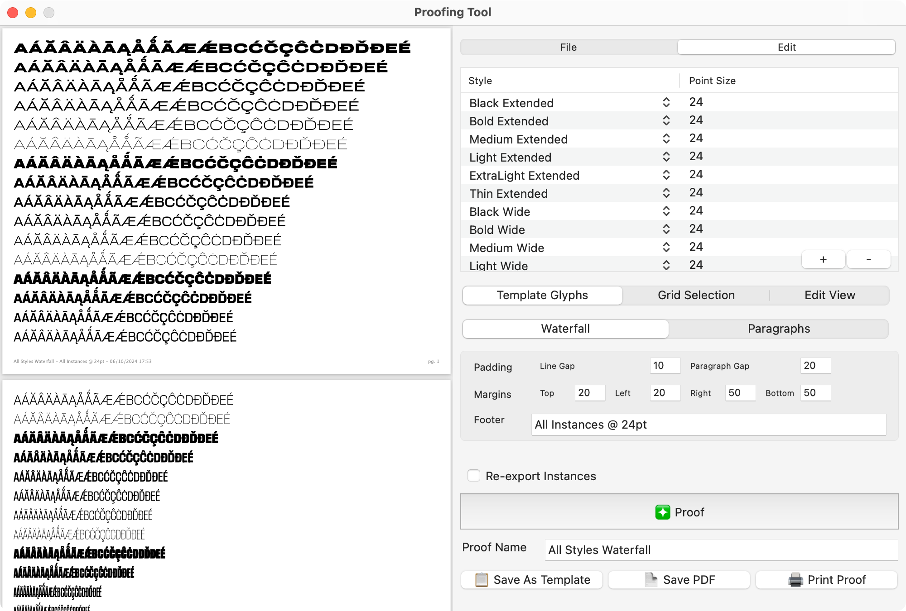
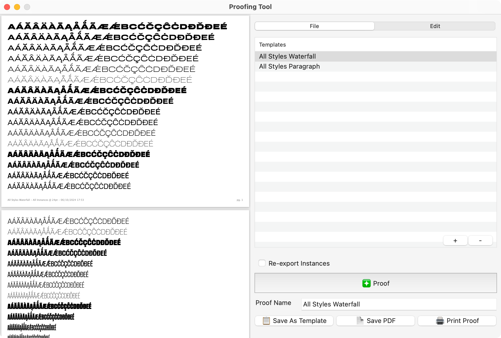
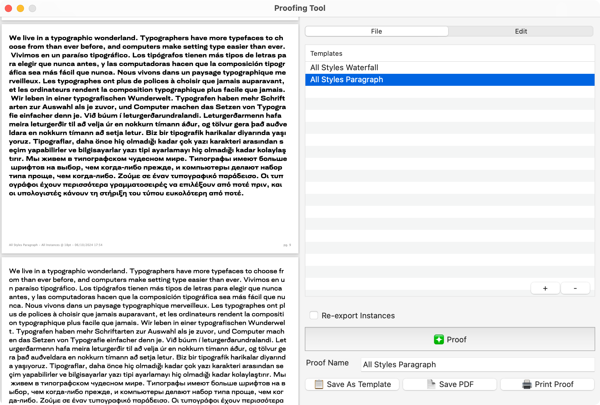
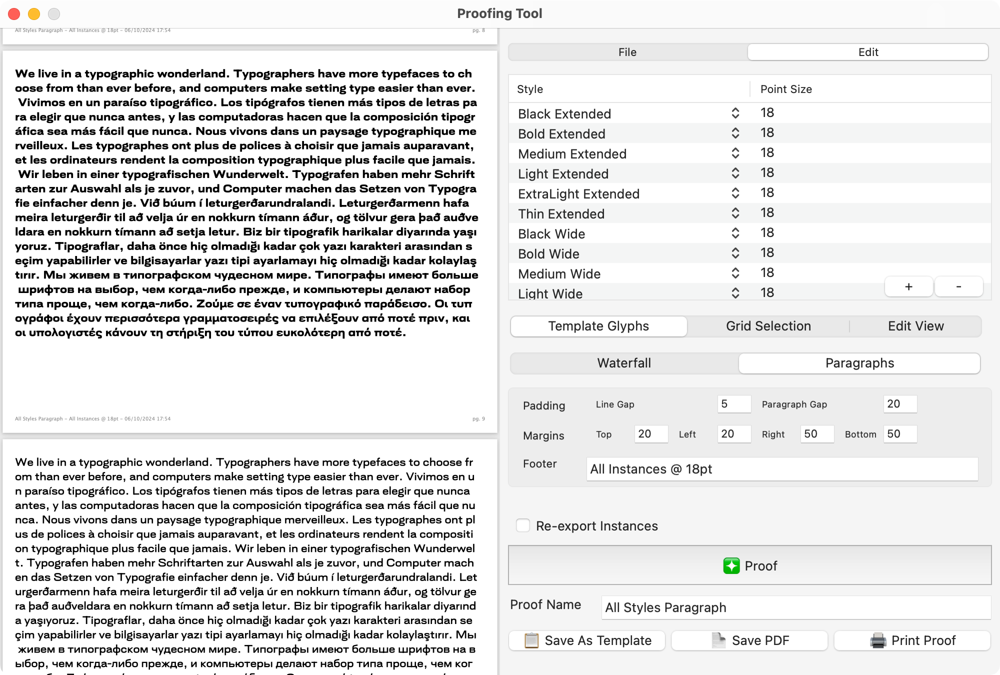
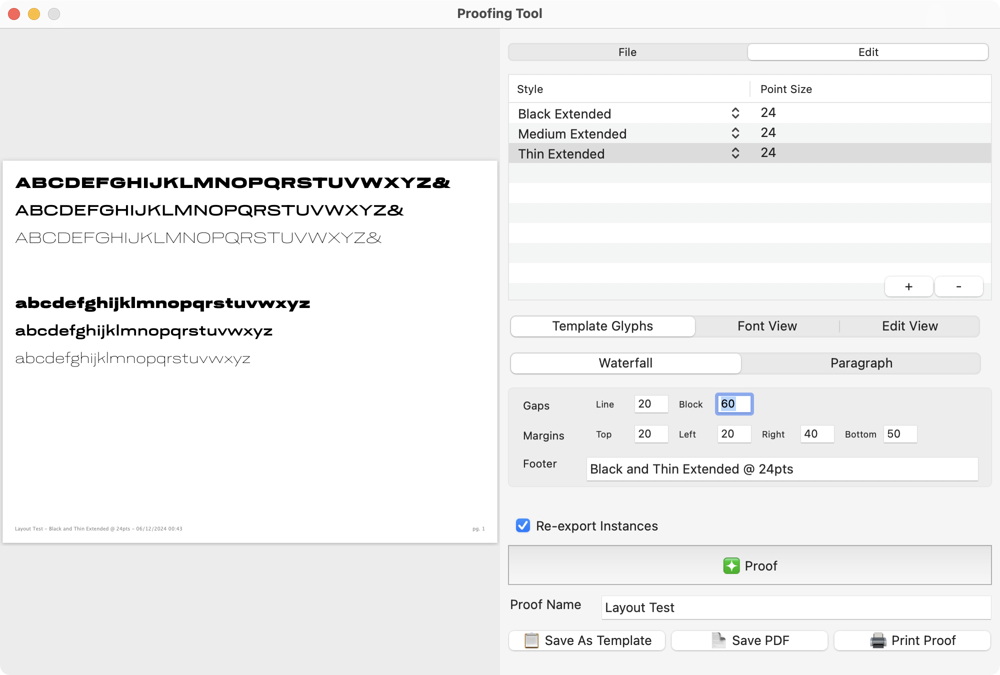
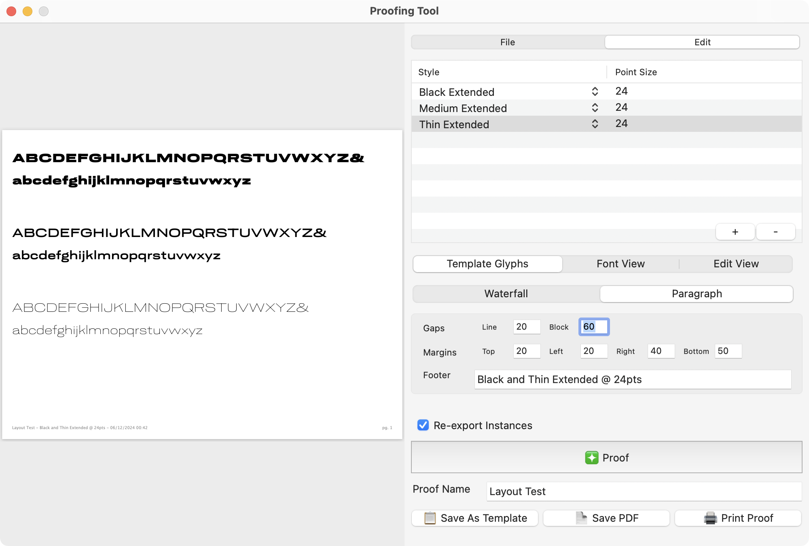

# Proofing Tool

This Glyphs Plugin helps you output proofs directly from Glyphs. The plugin focuses on generating form comparison proofs in two forms: [waterfall](#waterfall) and [paragraph](#paragraph) view. It currently isn’t intended to robustly proof typesetting (it won’t show [kerning](https://github.com/morisawausa/ProofingTool/issues/5), for example), but it should help you quickly format documents for proofing use without needing to export font binaries, deal with font caching, or open InDesign. We made this tool with the hope that it might reduce the annoyance of producing proofs for in-progress work intended for internal review.

Last tested in Glyphs 3.2.1 (3258).

## Prerequisites

1. You must have the following installed this to work. Install them via the Plugin Manager on Glyphs.
- Modules: Vanilla and Python
- Plugin: [DrawBot](https://github.com/schriftgestalt/DrawBotGlyphsPlugin)

2. Open a glyphs file. The tool will use your currently selected file to generate the proof.

3. Make sure that you have `exports` setup in your Font Information.

## Installation

1. Clone the Proofing Tool repo. It’s usually best to clone them into the `Repositories` folder in Glyphs, along the lines of `/Users/yourusername/Library/Application Support/Glyphs 3/Repositories`. 

2. Double-click on the `ProofingTool.glyphsPlugin` file. Glyphs App should open up and prompt you to install the plugin.

3. It will ask you whether you want to copy the plugin or use an Alias. Using the Alias option will help you pull any future updates to the tool.

4. Restart Glyphs

5. Open a `.glyphs` file and make sure there are instances setup. 

6. Go to `File > Proofing Tool` to start up the tool.


### On Setting up Exports
⚠️ The tool, by default, will use the `Style Name` field on the exports tab to setup the list of available instances.

However, in cases of multi-axes variable font, you may have duplicate `Style Name` entries across instances to support style-linked static font & VF exports from the same Glyphs file. In this case, the exports list will concatenate the default values in `Typographic Family Names` and `Typographic Style Names` (if specified, falling back to the `Style Name`.) 

This means that the proof templates may be setup with a specific family name, such as “Dispatch 2 Compressed ExtraLight” and won’t work for other typefaces. If re-using the template for another typeface, I recommend editing the template file in a text-editor to find-and-replace the Typographic Family Name. (We may be able to better extract style names by using more complex processing of those fields, but setting up the names in the Glyphs panel for production export can be tricky business, so let me know if you have any recommendations here.)

*If there are duplicate `Style Name` entries but no `Typographic Family/Syle Names` entries, there will be missing instances in the dropdown field selection.*


## Using the Tool

### 1. Load / Select a Template, or skip to step 2

In order to proof the typeface, first select a proofing template or create a new one. The window will load any previously-loaded templates in the window. You can load additional template files or remove them from the view with the `+` / `-` buttons. (Command / Shift Click to select multiple.)

If there are no previously-loaded templates, you will need to create a new template using the `Edit` tab.

### 2. Create / edit the template as needed.

To create a new template or adjust an existing template, click on the `Edit` tab. See Creating and Editing Templates using this [tool UI](#creating-and-editing-proof-templates-ui-option) as well as the [json template syntax](#creating-and-editing-proof-templates-text-editor-option)

### 3. Click the `Proof` button. 

This will apply the template with any additional edits.

### 4. Select your output.

Review the `Proof Name` field — this be the file name of your PDF. A slugified version will be the basis for the proof template file name.

- `📋 Save As Template` Save the current template as a new `.json` template file. Note: the Proof Name should be unique and not a duplicate of an existing template. (To do: support saving template changes to currently selected template, rather than always forcing a Save As.)

- `📄 Save PDF` Save a copy of the generated proof to your computer

- `🖨 Print Proof`Send the PDF to your printer

⚠️ If you have a lot of instances, generating the proof can take some time as instances are reinterpolated. To help with this, there is a `Re-export Instances` checkbox to keep checked if additional instances need to be proofed, or if you change the shapes of a master. Keep this unchecked for simple layout changes with no changes to the instances. (To do: this optimization may be automated down the line, tracked in issue [#12](https://github.com/morisawausa/ProofingTool/issues/12).)

## Creating and Editing Proof Templates: UI Option

The `Edit` tab allows you to set up your proof.



### Styles and Point Sizes
The first section lets you select the instances and point sizes you’d like to compare. Each line in the list on the edit view corresponds to a style and point-size in your proof. 

Use the `+` and `-` buttons to add / remove instances to this list. Note: it will ignore the variable font instance and only load static instances. (In case you missed it, see [Setting up Exports](#on-setting-up-exports) on caveats on instance naming.)


### Glyph Selection
You’ll then choose which glyphs you’ll want in the proof. You have 3 options:

- `Template Glyphs` these are the glyphs specified in the `glyphs` key of the template file

- `Font View` this option will use the glyphs currently selected in the Font View of the Glyphs app

- `Edit View` this option will use the glyphs currently displayed in the Edit View of the Glyphs app

### Proofing Mode

- `Waterfall` proofs are for line-by-line comparisons
- `Paragraph` proof are for block-by-block comparisons

A **Waterfall proof** prints _a single line of text_ per selected style, with each line of text containing the same set of glyphs.




The proof in the above image sets the character set of a type family in a waterfall style. The text is broken up into blocks of a single line per style or size (this image shows them all at 24pt, but this can also be set up where each line is a different size). Any text that doesn’t fit into the line is pushed to the next block. If the block doesn’t fit entirely on the page, the entire block is shifted onto the next page.

A key feature of the waterfall proof is that it *puts the same set of characters on each line*. This can be useful for comparing interpolation results across a family, checking alignment of diacritic placements, or identify any stray spacing errors. 

A **Paragraph proof** will output the entire set of specified glyphs together for each selected style.




In the paragraph proof, the entire text is displayed in a single paragraph, before we move on to the next style. (As you can tell from the above image, the Paragraph proof is best suited to longer chunks of text.)

A key feature of the paragraph proof is that it *full blocks of text* across styles. This can be especially useful for comparing textures with specific glyphs generated from the Edit View. Depending on where you are in the type design process, it might be a set of Nina Stössinger’s [word-o-mat](https://github.com/schriftgestalt/word-o-mat)-generated paragraph of control characters, a set of spacing strings, a test for stylistic alternates, or sample texts of a particular language.

### Layout

These settings help you adjust the spacing in and around the blocks of text in the proof. All of the measurements in this section are specified in pixels. (At some point, we may change these into more typographic units). 

`Gaps` settings control spacing within the proof content. `Line` refers to the space inserted between each line of text; `Block` refers to the space inserted between groups of lines. 

In **Waterfall mode**, the `Block` is a set of lines, one for each specified style, displaying the same set of glyphs that would fit on one line.




In **Paragraph mode**, the `Block` is effectively be the paragraph of all text for specified style.




Margins of the document is the space around the lines of glyphs. Note: a larger `right` and `bottom` margin is recommended, especially with the footer being inserted at the bottom.

*Currently, the Editing UI isn’t the most user-friendly.* You can’t drag-and-drop to reorder styles (ssue [#7](https://github.com/morisawausa/ProofingTool/issues/7)), or change all the sizes of each style at once (issue [#8](https://github.com/morisawausa/ProofingTool/issues/8)). For significant edits to your templates, we recommend using a Text Editor to directly edit the template data files.

## Creating and Editing Proof Templates: Text Editor Option

This tool uses a JSON-based template format to store proof configurations on a pre-project basis. You can version control these JSON files together with the rest of your typeface sources, if you wish. The intention here is to provide a way of quickly rendering proofs, without having to configure the tool each time you want to use it.

The easiest way to create a new template is to adapt the `templates/basic-letters.json` file in this respository to your font project. We often have a `proofs` folder for each of our font projects, where we keep both proof PDFs as well as project-specific templates. The Proofing Tool will automatically list previously-loaded template files.

The rest of this section will walk you through the template syntax. Note that the [JSON format](https://developer.mozilla.org/en-US/docs/Learn/JavaScript/Objects/JSON) is very strict, so it won’t work if there’s even a single syntax error—if you are new to JSON-editing, I recommend double-checking that your file is error-free through online JSON validators. (To do: allow UI to enable [debugging mode](https://github.com/morisawausa/ProofingTool/issues/21) for template errors) ⚠️ Don’t copy-paste the contents of the snippets below directly, as the explanatory comments within them will cause a syntax error in the resulting JSON. Instead, use the starter template above with the notes below as a reference.

At the root, the template JSON looks like this:

```js
{
  "name": "My Proof Name",
  "proof": { ... } // configuration for the proof
  "lines": [ ... ] // different styles to render...
  "glyphs": [ ... ] // list of glyph names in the file as strings.
}
```

You may want to set up some standard template proofs corresponding to various stages of your design process. But there are often variations with each font: they may have slightly different glyph sets to render, be drawn for different optical sizes, or have different master names, so it’s often helpful to be able to make custom templates for each project as well.

Let’s look at each of the keys in the JSON structure. The `"name"` key, obviously, is the name of the proof. It gets rendered at the bottom of the document and can be whatever you want.

The `"proof"` key contains all of the layout details for rendering the proof. It looks like the following JSON structure:

```js
{
  ...
  "proof": {
    /**
     * These are the page margins, in pixels. for ease of working with DrawBot,
     * the calculations for layout and rendering are done in pixel space. So far,
     * this hasn’t been a huge issue for us, but we may convert to a different
     * unit system at some point.
     */
    "margins": {
      "left": 20,
      "right": 50,
      "top": 20,
      "bottom": 50
    },
    /**
     * These are gaps (also in pixels) to put in between lines and
     * blocks. A line is a single line of glyphs running the length of the page.
     * a block is one contiguous block of glyphs. In waterfall mode, a block is
     * one line of glyphs across each style that you're rendering. In paragraph
     * mode, a block is one entire run of glyphs – paragraph – in a single
     * style. Line gap is added between each line, block gap is added
     * after each block.
     */
    "gaps": {
      "block": 20,
      "line": 30
    },
    /**
     * This is the rendermode: either "waterfall" or "paragraph"
     */
    "mode": "waterfall"
  },
  ...
}
```

The `"lines"` key specifies which styles to render, at which point size, and in which order. Styles are pulled from the instance list, and they must be unique. 

```js
{
  ...
  /**
   * Individual lines go in this array.
   */
  "lines": [
    /**
     * Each element in the lines array should be an object with a "style" and
     * "size" key. The style key should be the name of a master in the typeface.
     * The "size" is an integer specifying the pointsize to render that master
     * at. You can have as many of these as you want.
     */
    {"style": "Extra Light", "size": 50},
    {"style": "Regular", "size": 50},
    {"style": "Black", "size": 50},
    ...
  ],
  /**
   * This key is optional. Sometimes, you just want to render the same size
   * across a range of styles. In this case, you can add a default size here,
   * and then just specify the styles in the lines array.
   */
  "size": 50,
  /**
   * This key is optional. Sometimes, you just want to render the same style
   * at a range of sizes. In this case, you can add a default style here,
   * and then just specify the sizes in the lines array.
   */
  "style": "Regular",
  ...
}
```

Finally, the `"glyphs"` key specifies an in-order sequence of glyphs to render. This is fairly straightforward: just an array of glyph names as strings, just as `Glyphs.app` would expect them (nothing fancy, no leading `/`, etc. If you want the glyph `Aacute` to render, put `"Aacute"` in this list).

👉 An easy way to get a set of glyphs is to select them in Font View, right click, then `Copy Glyph Names > Python List`. Remove the last trailing `,` and wrap the list in `[]`, and assign it to the `"glyphs"` key. Note: if selecting glyphs from the Edit View, this Copy Glyph Names method will *not* preserve line breaks displayed. To specify a line break in the proof, add `"newGlyph"` in the glyphs list. (Line breaks are detected automatically when extracting glyphs from the Edit View using the Proofing Tool UI.)

## Issues
We’ve logged a number of other known issues on the repo. Feel free to leave any additional issues as you encounter them. Thanks!

## About
This proofing tool was created as an internal tool for [Occupant Fonts](https://occupantfonts.com/), with original development by [Nic Schumann](https://github.com/nicschumann) with input from [June Shin](https://github.com/notborninjune), [Cem Eskinazi](https://github.com/cemeskinazi), and [Cyrus Highsmith](https://github.com/cyrushighsmith), and further development by [Marie Otsuka](https://github.com/marieotsuka) in preparation for public release.

